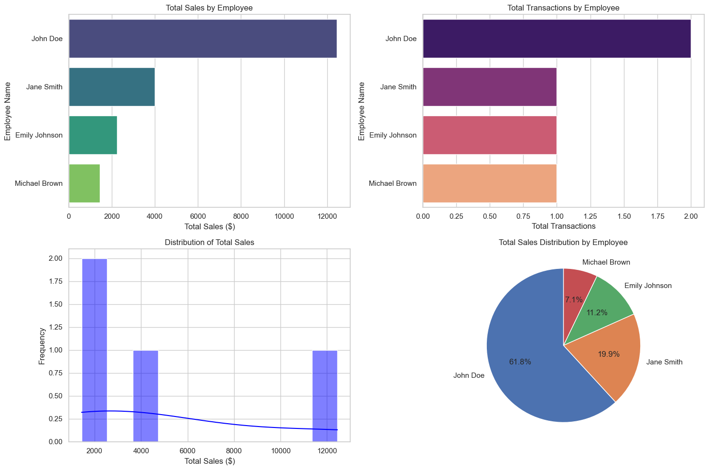

# Retail Sales Analysis

## Project Goal
This project demonstrates the use of MySQL and Python for retail sales data management and analysis. It showcases the creation of a MySQL database, implementation of an ETL process, and the application of advanced SQL queries to extract actionable insights. Data visualization techniques using Python are also included to present the results effectively.

## Key Operations
The following operations are performed within this notebook:

- **Database Creation**: Creation of a MySQL database named `RetailSalesAnalysis`.
- **Table Creation**: Design and creation of tables for:
  - Products
  - Stores
  - Employees
  - Sales
- **Data Insertion**: Population of the tables with sample data to facilitate comprehensive analysis.
- **ETL Process**: Implementation of an Extract, Transform, Load (ETL) process, including:
  - Creation of views for daily sales
  - Analysis of employee performance metrics
- **Data Analysis**: Execution of SQL queries to extract insights, such as:
  - Total sales per store
  - Employee performance indicators
- **Data Visualization**: Utilization of Python libraries (Matplotlib and Seaborn) to create visual representations of the data, including:
  - Bar plots
  - Histograms
  - Pie charts

## Screenshots

## Getting Started
To run this notebook, the following prerequisites are necessary:
- A MySQL server must be operational.
- Required Python libraries should be installed (e.g., `mysql-connector`, `pandas`, `matplotlib`, `seaborn`).

Environment variables should be updated as necessary to establish a connection to the database.

